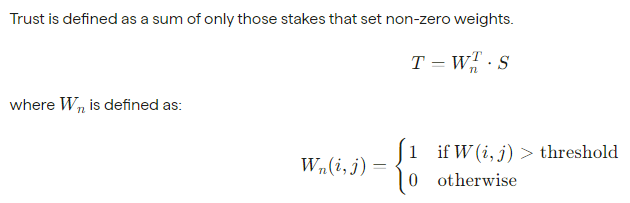
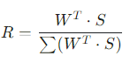
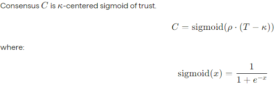
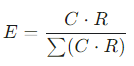

# IO.net

是一个去中心化计算网络，支持在Solana 区块链上开发、执行和扩展ML 应用程序。 io.net 是一个去中心化计算网络，支持在Solana 区块链上开发、执行和扩展ML （机器学习）应用程序，利用世界上最大的GPU 集群，以允许机器学习工程师以相当于中心化服务成本的一小部分，来访问分布式云服务算力。

**当前规模（2024-06-05）**
+ 24311（GPU） 

**代币经济学Url地址**

 _https://docs.io.net/docs/io-tokenomics_

## **IO.net的代币经济学分为三个原则**
+ 固定最大供应量8亿 IO币
+ 每小时奖励供应商及其利益相关者
+ IO币 销毁机制

### 固定供应 8亿 IO币
+ 推出时将分发 5 亿枚 IO 币。
+ 剩余的 3 亿枚代币将被发行并作为奖励支付给供应商及其质押者。每小时都会发生一次。

### 每小时奖励
+ 奖励按小时发放给供应商及其质押者，持续 20 年。奖励遵循通货紧缩模型，第一年从 8% 开始，每月减少 1.02%（每年约 12%），直到达到 8 亿美元 IO 上限。

### 销毁机制
IO.net 使用程序化代币销毁系统，其中 io.net 从 IOG 网络产生的收入用于购买和销毁 IO币。IO币 销毁机制根据IO币的价格调整要销毁的 数量。

## IOG网络费用来源
### GPU租赁费
+ 预订费：IOG 网络向用户收取计算预留总成本的 0.25% 的预留费。此费用在预留时添加到租用者的成本中
+ 付款费用：

    1. 对于 100% USDC 付款，将收取 2% 的手续费。
    2. 对于 100% $IO 付款，无需支付任何费用。

### GPU 供应商费用
+ 预订费：向用户收取预留节点总成本的 0.25% 的费用。这笔费用在供应商收到计算费用时收取。
+ 付款费用：

    1. 对于 100% USDC 付款，将收取 2% 的手续费。
    2. 对于 100% $IO 付款，无需支付任何费用。

## **IO.net中IO币的分配**
创始时的初始供应量为 500,000,000 美元（ **_从这里可以看出一个IO币 = 1美元_**） 

**分为五类**
+ 社区：50.0% = (250,000,000)
+ 种子投资者: 12.5% = (62,500,000)
+ A 轮投资者: 10.2% = (51,000,000)
+ 核心贡献者: 11.3% = (65,500,000)
+ 研发和生态系统: 16.0% = (80,000,000)

## IO币分配限制
+ 投资者：分配给投资者的 IO币 限制期限为三年。转让限制从第 13 个月末开始，以 24 个相等的部分从 IO币 开始解除，直到首次分配日的第 36 个月周年纪念日结束。

+ 研发与核心贡献者：分配给员工的 IO币 限制期限为四年。转移限制从第 13 个月末开始，分 36 个相等部分从 IO币 开始解除，直到首次分配日期的第 48 个月周年纪念日结束

## 质押
+ 将 IO币 作为抵押品投入网络中的节点，并获得每小时节点可用性奖励 [区块奖励]的一部分 

### 可用性奖励

按小时支付给供应商，以使其 GPU 或 CPU 在 IOG 网络上可用并激励供应方网络增长。此支出以美元计价，以 IO币 计价

#### 可用性奖励计算

每小时可用性奖励以节点为基础计算。其他因素包括带宽（连接速度）、正常运行时间比率、硬件类型等。

**_可用性奖励的公式基于基准模型，假设节点仅获得可用性奖励，该模型允许供应商实现其硬件资本支出约 1.5 年的回报_**

详见公式

**每个节点每小时可用性奖励的近似值=（硬件资本支出/18 个月内的小时数）正常运行时间百分比 x 95%供应商份额
公式中的供应商份额设置为 95%，因为 Stakers 可获得供应商可用性奖励的 5%。**

#### 可用性奖励要求
+ 每个节点，当设备被承诺但未被客户租用时，将支付可用性奖励
+ 如果节点在任意小时时段的正常运行时间低于 100%，则可用性奖励可能会被削减
+ 节点若要获得可用性奖励，必须至少质押100 美元 IO币（100 IO币）
+ 如果每个节点质押的 IO 超过最低抵押要求，每小时的 IO 奖励将超过基准 1.5 年回报
+ 每个节点的最大质押量由硬件型号、带宽（连接速度）、正常运行时间比率和完成的工作时长决定
+ 如果节点在可用时离线，其质押将被削减一小时的可用性奖励，并失去该小时的奖励。如果终止或暂停，该节点将失去该小时的可用性奖励
+ 每当节点终止或暂停然后重新连接时，可用性奖励收入都会有一个 12 小时的冷却期

### 质押奖励

#### 质押步骤
+ Staker 在网络中选择一个节点运营商
+ 质押者声明要质押的 IO币 金额
+ 将 IO币 质押给节点运营商。

#### 质押奖励

**质押者分享供应商 $IO 奖励的 5%**

#### 质押注意事项
1. 节点需要为每个节点实现至少100 美元的 IO抵押品
2. 每个节点的最低抵押品可以由供应商或任何其他 Staker 提供
3. 抵押品基本上会被锁定 7 天
4. 取消质押资金将在 7 天内无法使用
5. 节点被雇用则不能请求取消质押

**_抵押品充当保险基金。如果 io.net 检测到数据泄露、欺骗或其他恶意活动，则 $IO 抵押品和任何应计收益或奖励将被削减，以补偿数据泄露和对消费者的损害_**

#### 节点质押数量公式
**节点最大质押 = 设备最大权益 x (2 + 3 x [修改器选项之和])_**

如果节点无法提供预留的容量，则可用性奖励会被销毁

# CloreAI
CloreAI是一个GPU租用平台，采用btc和CLORE由miner定价，通过marketplace呈现给需求方购买。

## 节点信息 
2024-06-05
Online machines：4797
Machines rented：3058

## 历史
+ 2022年2月上线
+ 2022年12月采用BTC支付
+ 2023年6月引入了 Clore 挖矿功能。如果用户的农场没有出租，它可以自动挖掘出收益最高的货币，并在出现更好的货币时进行切换。
+ 2023年9月，clore.ai在MEXC上市，
+ 2024年5月，Clore VPN，可能允许clore.ai托管提供商将其网络租赁为 VPN 服务

## 平台收费
对现货市场下的订单收取2.5%的费用，对按需订单收取10%的费用（比特币支付），对于美元支付，由于交易费用较高，我们收取19.5%的费用，外加非常低的订单创建费（低于$0.01）。

## 持有证明 （Proof of Holdings）
用户持有的 Clore 币越多，在租赁设备时获得的奖金 $clore 就越多。PoH不是质押，相比于质押
1. 设备方增加了收益
2. 不需要像质押一样做转移
3. 租用方节省了费用
4. 不需要像质押一样冻结
5. 可以参加，也可以不参加
6. 没有惩罚

## 币值 CLORE
2024-06-05
Total Supply：360M
Price：$0.1651
Market Cap：$ 59M

# Bittensor
Tao（bitTensor）的基础架构，Bittensor 建立在波卡生态上，使用自己独立的基于 Substrate 的 L1 区块链。在根子网的基础上，可以建立若干子网，每个子网包括validator，miner两类节点，同时包括子网creator，以及质押人。

validator的流程：由validator发起挑战任务，并且与正常业务请求不可区分，然后采用标准答案与miner返回值对比差异，确定权重系数，为miner后面的激励分配提供依据。

## ai任务处理的流程
1. 查询被发送到验证器，然后发送到连接的矿工
2. 矿工的响应回到验证器，创建评估并输出
3. Yuma 向每个子网发出 Tao。

## 相比于NGPU
1. 没有中央的调度，由用户自己选择一个subnet validator完成ai的推理
2. Validator自己也发起校验任务，根据结果调整miner的信任系数。YC根据任务量系数分配Tao子网，然后根据固定比例给creator，miner，validator三类角色。给miner根据validator的权重系数
3. Miner/Validator和subnet都在各自层面进行竞争，排序差的被淘汰。
4. 申请Subnet、Miner/validator都需要Tao作为费用。

+ 根子网：只有64个经过竞争上线的validator，没有miner，validator对于每个子网进行评估，保留权重系数，从而确定每个子网的激励值。

## 激励分配

最好的模型（子网）获得最多的奖励，token  21M，每一个block 12秒会新生成一个Tao。目前没有销毁 采用Tao购买子网提供的Ai服务。
20240605的数据：
已运行天数：945天
活跃账户：86,492
总质押：5,751,813 Tao
总发行token：6,885,398
这一个Tao将根据每个子网的性能分配给各子网。根网络决定每个子网的百分比部分。因此，所有这些部分的百分比分配将总和为100%，即一个 TAO (𝜏)。
根子网决定每个子网的激励：
1. 统计每个validator对于每个子网的权重W，考虑质押以后转化为Trust T

可见，W只要满足一定数值即可，而stake是线性增加的。
2. 计算Rank，采用加权平均计算

3. 计算Consensus，但是rho，与T具体含义未明确

4. 计算每个子网的分发量

18% of it goes to the subnet owner.
41% goes to subnet validators (this is called dividend).
41% goes to the subnet miners (this is called incentive).
对于矿工，按照与子网相似的方法分配激励。validator没有说明。
每360个块，会将累计的Tao分发给各方。

## 激烈的竞争机制
1. 子网creator需要通过Tao购买才能创建，而子网性能会被持续监控，表现不佳的子网将被注销，并且注册费用将退还给被注销的子网所有者。子网的性能通过子网获得的排放量（token）来衡量：子网获得的排放量越低，子网的性能越差。任何子网都有一个免疫期，为 7 * 7200 个区块，即 7 天。在此免疫期内，子网不会有被注销的风险。在此免疫期结束时，如果该子网的排放量在所有子网中是最低的，那么当有新的子网注册请求到来时，该子网将被注销。
2.  miner，validator需要购买Tao进行质押才能安装。除了子网1可以是1024个节点，其余都为256，最多64个validator + 192个miner。同样是竞争上岗。

## 收益
目前，用户能够参与 Bittensor 生态的方式包括：注册成为子网、成为验证者、成为矿工、购买 TAO 参与质押。前三者可以获得 Bittensor 每日市场的 7200 枚 TAO 的分配激励，仅参与质押可以获得约 APY 15% 的收益。而成为前三者也需要质押 TAO。
验证节点和矿工每日所获得的 TAO 奖励基于各自贡献，并由一个固定公式确定：INCENTIVE * (EMISSION * 0.41) + DIVIDENDS * (EMISSION * 0.41)，其中 EMISSION 代表子网铸造 TAO 的份额，DIVIDENDS 代表子网中所有验证者的权益百分比权重。在每日分配总量中，82% 由验证者和矿工平均分配，其余 18% 归子网所有者所有。

## 治理
高的质押比例，锁住了83.5%已发行的Tao。

## 投票
三巨头之一就可以产生提案 ==> 超过2%质押量（含委托）等4个条件的人可以竞选senate，12个席位，投票决定 ==>  三巨头执行在此之前，由单一私钥掌管

## 选举
senate：12个席位经过竞争获得，账户质押额要高于总质押额的2%。

## 委托/代理
受委托人将获得被委托部分18%的收益，这样可以实现委托理财，也可以委托给Opentensor Foundation 

## 质押
节点、子网的必需品

## 交易情况
2024-06-05，Tao
Price：$392.85
Market Cap: $2.70b
24 h volume: $26.54M
Total Supply: 21M

## 子网注册质押   
2024-05-14 $2374.21

# Akash Network ($AKT)

Akash 网络: 基于cosmos 的去中心化云计算平台

由以下几个主要部分组成: Akash 提供商，管理基础设施和 Kubernetes 集群；Akash 网络，一个类似于 Airbnb 的数据中心多功能平台，提供成本效益、选择、标准化资源、开源原则和社区参与；以及 Akash 租户，将应用程序部署为 Docker 容器，受益于去中心化部署。它们共同构成了 Akash 网络的基础

## 交易所
- Exchange: Osmosis、Coinbase、upbit、Kraken、Gate.io、HTX、KuCoin、Cryptom.com、Bitthumb、XT.com

## 2024.6.5 币值信息
- 价格: $4.47
- 总供应量: 239,310,076 AKT
- 最大供应量: 388,539,008 AKT
- 24小时交易量: $13,298,207

## AKT作用
- 安全: 为 Akash 网络由权益证明 (PoS) 区块链保护，而 AKT 用于通过质押来保护网络。质押 AKT 为质押者提供了被动收入来源，并提高了网络的安全性。
- 治理: Akash 网络由社区所有，网络的各个方面均由 AKT 持有者管理。AKT 持有者可以对改进网络的提案进行投票，并管理通货膨胀率和收取率等关键参数。
- 价值交换: AKT 提供了一种存储和交换价值的默认机制，并充当 Cosmos 多币种、多链生态系统中的储备货币。
- 激励: 为 Akash网络生态提供激励

## 经济模型图： 

- [AKT 解锁时间表](https://docs.google.com/spreadsheets/d/1MUULetp59lgNq0z4ckVI51QdtMGvqtKOW8wRfX5R8yY/edit#gid=2130333819)

## AKT 2.0的主要特点是
- 收取和支付费用（现已上线）
- 稳定的支付和结算（现已上线）
- 激励分配池
- 供应商补贴
- 公共物品基金

## AKT 2.0 详情

### 网络安全与AKT值成正比

Akash 网络通过其权益证明共识来确保安全，这要求质押者使用 AKT 代币作为质押。质押的 AKT 越多，网络的安全性就越高。AKT 的价值由需求驱动，因此随着网络使用量的增加，其价值也必须增加，以保证所有参与者的最大安全性。

正如原始经济学 [paper][akt-economics-1], AKT 的初始供应量, $t=0$, 定义为 $M_0 = 10^8$ AKT 的最大供应量计算为 $M_{max}\approx3.89 M_0$ 和 $M_{max} - M_0$ 在网络的整个生命周期内，将代币分发给 AKT 质押者，作为保护网络的奖励。奖励在每个区块中分配，金额由[Cosmos SDK `x/mint` module][cosmos-sdk-x-mint]模块中定义的网络参数决定。

这些网络参数是通过链上治理设置的，并遵循衰减函数，随着时间的推移，通货膨胀率会降低。随着奖励金额随着时间的推移而减少，对于 AKT 持有者来说，通过质押锁定其代币的吸引力会降低，从而降低了网络的安全性。

### 收取并支付费用

由于 AKT 的价值由需求驱动，我们建议网络对租户向提供商支付的托管费征税，并将其分配给网络的安全预算。这确保了 Akash 网络的使用和安全之间的直接一致性。

Akash 是一个去中心化交易所，市场的健康取决于其交易商品（计算）的流动性。我们建议租户在从市场获取流动性时支付手续费，提供商在向市场提供流动性时支付手续费。手续费在创建时从订单中扣除，并由网络通过链上治理设定.

预计 AKT 持有者将选择足够高的费用来确保网络安全，但又不会太高而阻碍网络的使用和增长。

### 支持多种货币，支付结算稳定

我们建议 Akash 网络实施多代币结算机制，允许使用稳定代币支付托管费用，让用户能够预先预测托管成本。代币白名单可以通过链上治理完成。

此外，每一种列入白名单的货币都会被分配一个`Fee Discount Rate`，$R_d$ 这是由网络通过链上治理设定的。折扣适用于付款或结算`Take Fee`期间`Make Fee`。由于鼓励使用 AKT 进行支付和结算符合 AKT 持有者的最佳利益，因此我们预计使用 AKT 时折扣会很有吸引力。当设置为 100% 时，网络不会向 AKT 用户收取任何费用。

### 激励分配池

激励分配池包含一篮子白名单货币和 AKT，这些货币和 AKT 会分配给网络参与者，作为他们对网络贡献的奖励。该池的资金来自上述收取的费用和通货膨胀奖励Take Fee。Make Fee

该池将分配给以下一组参与者。分配给每个参与者的池份额由网络通过链上治理确定。

- 供应商补贴

Early on in the network's lifecycle, the network will need to subsidize providers to ensure the network has enough computing power to offer attractive prices to tenants.

There are numerous ways to subsidize providers, some considerations are:

* Cover cost of the operational and amortized cost of the hardware for a period of time.
* Incentivize based on amount wokload they host, similar to [Filecoin Plus][filecoin-plus] Program.
* Use an "exponential discount model" described in Evolution of the Akash Network Token Economics [blog post][akt-evolution].

- 公共物品基金

We propose a portion of the Tokens from the `Incentive Distribution Pool` be allocated to the Public Goods Fund to incentivize the growth of the Akash Network. The Public Goods Fund is a pool of AKT that is distributed to developers who build applications that grow the Akash Network and its adoption. The Developer Fund is distributed through on-chain governance.

The mechanism for distributing the Developer Fund will be determined by the [Steering Committee][streeing-committee].

### 质押者

我们建议将部分代币Incentive Distribution Pool分配给公共产品基金，以激励 Akash 网络的发展。公共产品基金是一个 AKT 池，分配给开发应用程序以发展 Akash 网络及其采用的开发人员。开发者基金通过链上治理进行分配。

开发者基金的分配机制将由指导委员会决定。

### 社区池

我们建议将收取的费用的一部分分配给社区池，通过链上治理进行分配，以发展社区

### Burn Remaining Tokens

所有以非 AKT 代币计价的费用都通过去中心化交易所（如Osmosis ）兑换为 AKT ，并与池中的 AKT 一起销毁。

TODO：本提案未考虑 Gas 费用和滑点。我们需要确定如何计算这些费用。

## Calculations

我们定义 $F_t$ 作为`Take Fees`网络为部署而收集的数据，可以表示为:

$F_t = \digamma_0 \cdot R_t \cdot (1 - R_d)$

和, $F_m$ 作为`Make Fees`网络为部署而收集的信息，可以表示为:

$F_m = \digamma_0 \cdot R_m \cdot (1 - R_d)$

- $\digamma_0$ : 是Hosting Fee租户为部署提供的金额

- $R_t$ : 是Take Fee Rate由网络通过链上治理设定

- $R_m$: 是Make Fee Rate网络通过链上治理设置的 

- $R_d$: 是Fee Discount Rate网络通过链上治理设置的代币

- $R_t, R_m, R_d \in [0, 1]$.  

网络为部署收取的费用是:

$F_n = \digamma_0 \cdot (1 - R_d) \cdot (R_t + R_m)$

向提供商提供的订单费用是:
$F_p = \digamma_0 - F_t$ 或 $F_p = \digamma_0 \cdot (1 - R_t \cdot (1 - R_d))$

