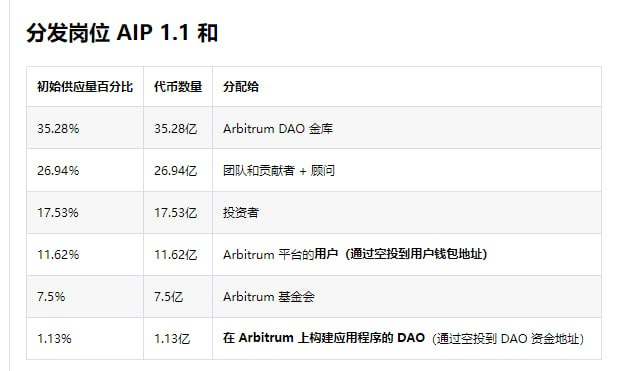

# NGPU代币经济学

## 激励整体分配
+ 算力提供方、生态：51.0%
+ 投资机构：17.0%

**<span style="color:red;">基金会、团队、顾问：24.0%</span>**
+ 基金会：11.0%
+ 团队、顾问：13.0%

<span style="color:red;">_以下信息作为参考，发布时会删除_</span>
+ Arbitrum



+ AKash

- 投资者（34.5% 或 3450 万 AKT）：锁定一年后释放约 1730 万 AKT，按照分级归属计划，每六个月解锁约 860 万 AKT
- 团队和顾问（27% 或 2700 万 AKT）：锁定一年后释放 1100 万 AKT，按照分级归属计划，每六个月解锁 600 万 AKT
- 去中心化云基金会（19.7% 或 1970 万 AKT）：按照分级归属计划在 TGE 解锁 100 万 AKT，第一个月后解锁约 890 万 AKT，接下来六个月后解锁约 410 万 AKT，之后约 210 万 AKT接下来的 11 个月和另外两个 6 个月后
- 生态系统（8% 或 800 万 AKT）：锁定 1 个月后释放 200 万 AKT，按照分级归属计划在前 6 个月后解锁 150 万 AKT，然后在接下来的 11 个月后，然后在另外两个月后解锁六个月的时间
- 测试网（5% 或 500 万 AKT）：800,000 AKT 在锁定一个月后释放，按照分级归属计划在前六个月后解锁 105 万 AKT，然后在接下来的 11 个月后，然后在另外两个 6 个月后解锁- 月周期
- 供应商和营销（4% 或 400 万 AKT）：800,000 AKT 在锁定一个月后释放，按照分级归属计划在前六个月后解锁 800,000 AKT，然后在接下来的 11 个月后，然后在另外两个月后解锁六个月的时间
- 公开发售（1.8% 或 180 万 AKT）：无归属时间表


## 角色定义

**基本角色**
+ **算力提供方：**  拥有GPU算力，并通过安装客户端登陆到我们的NGPU平台.
+ **算力需求方：**  需要GPU算力为自己的APP或者应用提供算力支持的需求方.
+ **AI用户：**  使用算力需求方提供的DAPP，并发起AI任务后使用到NGPU的算力用户.

**衍生角色**
+ **质押者：** 质押一定数量的（USDT、BTC、ETH ...）到指定的GPU算力节点上，成为算力节点任务激励的受益者。

**<span style="color:red;">质押者和算力节点是一体的，在收到激励后，质押者与算力节点之间的分配由他们自行决定（后期NGPU可提供节点质押分配智能合约，按照分配智能合约中的分配比例为每个算力节点与质押者进行收到激励后的分配）</span>**


## 激励定义

### 网络激励

NGPU为了激励Miner安装NGPU客户端并登录NGPU平台形成弹性算力网络，为Miner提供的组网成本激励——<span style="color:green;">网络激励</span>。

+ **分配间隔**
```json
网络激励每隔 5 分钟进行一次分配。
```

+ **每次分配网络激励算力节点**
```json
为了避免大量撸毛算力节点的出现。分配网络激励的算力节点将只为实际分发了工作任务的算力节点，以及一定数量的闲置节点发放。闲置节点数量根据实际分发数量按照比例产生，随机算力节点每天进行随机产生。

分配网络激励的算力节点 = 分发了工作空间的算力节点 + 冗余闲置节点
```

+ **单算力节点分配算法**
```json
单算力节点网络激励 = 算力节点算力值 / Σ（算力节点的算力值）
```

### 任务激励
NGPU为了激励登录平台的算力节点能够积极的为AI任务提供服务，每一次完成AI任务后为算力节点提供的激励叫任务激励。任务激励的设计原则为多劳多得。

+ **分配间隔**
```json
任务激励每隔1小时，对处理完成的AI任务进行任务激励数值计算。
```

+ **标准算力节点定义**
```json
GPU类型：Nvidia 4090
存储：100G
带宽：50Mbps
```

通过标准算力节点计算出的HashRate称之为 <span style="color:green;">标准算力</span>

+ **计算公式**

```json
单算力节点任务激励 = Σ（（每个AI任务消耗GPU时长（秒） * 处理AI任务的算力节点算力值 / 标准算力）* 标准算力每秒算力节点任务激励值 ）
```
+ 算力节点任务激励 来自算力需求方支付的费用（USDT、BTC、ETH ...）转换为平台激励，NGPU收取一定的手续费。
+ 冗余节点的处理：算力节点在获取任务激励时，一部分任务激励将分给此工作空间的冗余节点。


## 角色与激励关系

**算力提供方**
+ **网络激励：** 算力提供方登录NGPU后形成算力网络，经过测量后算力节点可以定期获得网络激励。 
+ **任务激励：** 算力节点成功AI任务后可以获得任务激励。

**算力需求方**

算力需求方（DAPP方）在NGPU平台中作为付款方存在，算力需求方可支付（USDT、BTC、ETH ...）给NGPU，NGPU转化为平台激励并收取一定手续费后将支付给算力节点（任务激励）。NGPU定期、不定期从市场购买激励进行销毁。从而稳定价格。

**付款费用**
+ 算力需求方可以支付（USDT、BTC、ETH ...）来进行支付，NGPU收取一定的手续费。

**用户（只做统计、不做激励）**
+ 用户执行AI任务的数量、消耗时间NGPU将提供详细的列表，DAPP方可以根据这些列表自行激励，NGPU不对用户进行激励。

## 质押定义
+ **算力节点在质押后才能得到激励（网络激励、任务激励）**
+ **每个算力节点至少质押100USDT数量才可获得激励（网络激励、任务激励）**
+ **质押者可以自由选择自己质押的算力节点**
+ **质押数量成为节点SLA的一个因子，算力节点没有质押时，等级为最低等级**
+ **质押者质押锁定期<span style="color:red;"> 7天</span>**
+ **算力节点掉线时，<span style="color:red;">系统会从质押中扣除1小时算力节点获得任务激励同等数量的激励</span>，同时不对算力节点进行本小时的激励**


